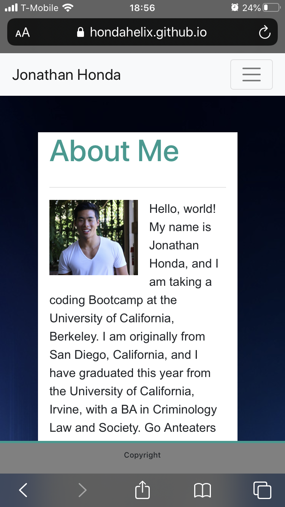

# responsive_portfolio

## Description 

The directions were to make a responsive portfolio that was mobile responsive. I started by making three HTML documents named index.html, portfolio.html, and contact.html. Then followed the pictures provided to format my page, so my project mirrored the pictures. I was able to accomplish mobile and different platform compatibility by utilizing the grid steam in Bootstrap and changing the column sizes. I further utilized Bootstrap to make a navbar and used forms for my contacts page. 

I became stuck on the About Page portion that enables the text to wrap around the image, but I overcame this by lots of research and learning the solution was to have the picture pulled left. Through this project, I gained a greater understanding of borders, margins, and padding and how to adjust the sizing on these elements. 

I am looking forward to the feedback I receive from this project to learn how to improve as a web developer and how I can better hone my abilities. 

## Table of Contents 

* [Installation](#installation)
* [Usage](#usage)
* [Credits](#credits)
* [Badges](#badges)

## Installation

The installation for this project is to go my github repositories then navigate to Code_Refractor or click this link [Responsive Portfolio](https://github.com/hondahelix/responsive_portfolio) then click on the green code button in the top right. Then you can copy the code via ssh or by downloading a zip file.

## Usage 

Although this version of my portfolio is clumsy, at best, this project's usage is that I now have a place to display my future projects. This portfolio will continue to improve as I further learn and practice. Below are the screenshots that I took from my iPhone, iPad, and computer, respectively. 

                        iPhone screenshot of About Me

                        iPad screenshot of Portfolio

                        Computer screenshot of Contact

## Credits
Third party assets and instruction was provided by the University of California, Berkeley Full Stack Coding Bootcamp program. As well as resources utilized from w3schools and Bootstrap.

[UCB Coding Bootcamp](https://bootcamp.berkeley.edu/coding/)

[Bootstrap](https://getbootstrap.com/)

[w3schools](https://www.w3schools.com/howto/howto_css_social_media_buttons.asp)

---

## Badges

